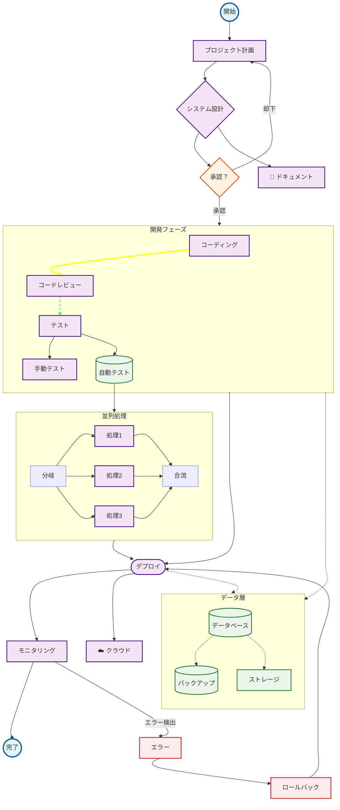

```mermaid
%%{ init: { 'flowchart': { 'curve': 'cardinal' } } }%%
flowchart TD
%% スタイル定義
classDef startEnd fill:#e1f5fe,stroke:#01579b,stroke-width:3px
classDef process fill:#f3e5f5,stroke:#4a148c,stroke-width:2px
classDef decision fill:#fff3e0,stroke:#e65100,stroke-width:2px
classDef database fill:#e8f5e8,stroke:#2e7d32,stroke-width:2px
classDef error fill:#ffebee,stroke:#c62828,stroke-width:2px

    %% メインフロー
    START(("開始")):::startEnd
    PLAN["プロジェクト計画"]:::process
    DESIGN{"システム設計"}:::process

    %% 決定ポイント
    APPROVAL{"承認？"}:::decision

    %% 開発サブグラフ
    subgraph DEV ["開発フェーズ"]
        direction LR
        CODE["コーディング"]:::process
        REVIEW["コードレビュー"]:::process
        TEST["テスト"]:::process

        %% 特殊な形状
        MANUAL["手動テスト"]:::process
        AUTO[("自動テスト")]:::database

        CODE --> REVIEW
        REVIEW --> TEST
        TEST --> MANUAL
        TEST --> AUTO
    end

    %% データベース関連
    subgraph DATA ["データ層"]
        direction TB
        DB[("データベース")]:::database
        BACKUP[("バックアップ")]:::database
        STORAGE["ストレージ"]:::database

        DB -.-> BACKUP
        DB -.-> STORAGE
    end

    %% 展開とモニタリング
    DEPLOY(["デプロイ"]):::process
    MONITOR["モニタリング"]:::process

    %% エラーハンドリング
    ERROR["エラー"]:::error
    ROLLBACK["ロールバック"]:::error

    %% 終了
    END(("完了")):::startEnd

    %% メインフローの接続
    START --> PLAN
    PLAN --> DESIGN
    DESIGN --> APPROVAL

    %% 条件分岐
    APPROVAL -->|承認| DEV
    APPROVAL -->|却下| PLAN

    %% 開発後のフロー
    DEV --> DEPLOY
    DEPLOY --> MONITOR
    MONITOR --> END

    %% データベース接続
    DEV -.-> DATA
    DEPLOY -.-> DATA

    %% エラーフロー
    MONITOR -->|エラー検出| ERROR
    ERROR --> ROLLBACK
    ROLLBACK --> DEPLOY

    %% アイコン付きノード（FontAwesome使用）
    DOCS["📄 ドキュメント"]:::process
    CLOUD["☁️ クラウド"]:::process

    DESIGN --> DOCS
    DEPLOY --> CLOUD

    %% 並列処理の例
    subgraph PAR ["並列処理"]
        direction LR
        P1["処理1"]:::process
        P2["処理2"]:::process
        P3["処理3"]:::process

        SPLIT["分岐"]
        JOIN["合流"]

        SPLIT --> P1
        SPLIT --> P2
        SPLIT --> P3
        P1 --> JOIN
        P2 --> JOIN
        P3 --> JOIN
    end

    %% 並列処理への接続
    AUTO --> PAR
    PAR --> DEPLOY

    %% 特殊なリンク
    linkStyle 0 stroke:#ff3,stroke-width:4px
    linkStyle 1 stroke:#3f3,stroke-width:2px,stroke-dasharray: 5 5

    %% コメント
    %% このフローチャートは包括的なサンプルです
```
